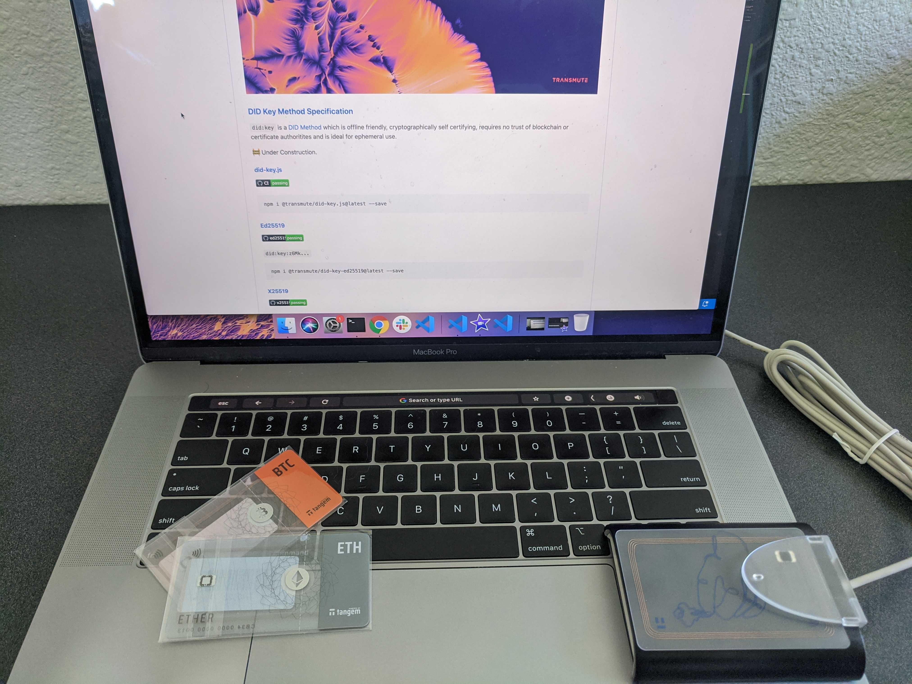

# nfc.did.ai

This repo contains nfc experiments, and some custom tooling for working with tangem nfc cards.

None of this is endorsed by tangem / nxp and any code is unoffocial / alpha level stuff... for reference only.

DO NOT USE IN PRODUCTION.

### Tangem Demo

In this demo, we use `did:key` and tangem cards to resolve a DID, and issue credentials from the associated private key. This is a demo of hardware isolated, offline capable decentralized identifiers and verifiable credentials powered by NFC.

<a href="https://drive.google.com/file/d/1pwcI97c65gv_a-wVjRc-bZZiNI6eey_u/view" target="__blank">
  

    
  

</a>

### NXP Demo

Some demos store seed values in querystrings, which is fundamentally not safe, and is used only for web-nfc demonstration purposes.

For example: [https://nfc.did.ai/nxp?seed=7052adea8f9823817065456ecad5bf24dcd31a698f7bc9a0b5fc170849af4226](https://nfc.did.ai/nxp?seed=7052adea8f9823817065456ecad5bf24dcd31a698f7bc9a0b5fc170849af4226)

DO NOT DO THIS IN PRODUCTION.

  

